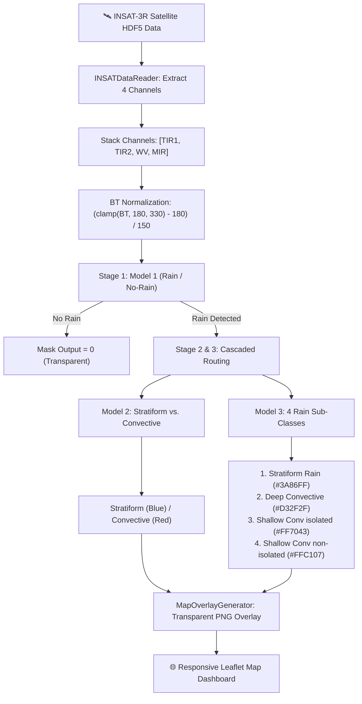

# 🌧️ PRECIPCAST — INSAT-3R Deep Learning Precipitation Platform

> **PrecipCast** is an end-to-end Deep Learning precipitation classification, sub-class identification, and web-based satellite visualization platform built for INSAT-3R satellite observation data across India.
> 
> 📌 **Project Status**: This repository represents **Phase 1 (Version 1.0)** of the PrecipCast platform development pipeline.

---

## 🎬 Application Preview & Demo


*Figure 1: Real-time INSAT-3R precipitation classification animation over India, demonstrating TIR1 thermal brightness temperature satellite imagery alongside Model 1 (Rain/No-Rain) and Model 3 (Sub-Classes including Shallow Rain) predictions.*

---

## 📌 Project Overview

PrecipCast processes multi-spectral Thermal Infrared (TIR) and Water Vapor (WV) satellite observations from ISRO's INSAT-3R geostationary satellite to perform high-resolution spatial rain detection and detailed cloud/precipitation type classification over the Indian subcontinent ($7.0^\circ\text{N} - 37.0^\circ\text{N}, 68.0^\circ\text{E} - 97.0^\circ\text{E}$).

The platform features a **3-stage cascaded Deep Learning pipeline**, a lightweight **PyTorch dynamic inference engine**, a **Flask REST API server**, and a fully **responsive Leaflet web dashboard** (optimized for Desktop, Tablet, and Mobile devices).

---

## ⚡ Key Features

- **Cascaded Deep Learning Architecture**:
  - **Stage 1 (Model 1)**: Binary Rain vs. No-Rain segmentation (`rain_norain_BT_New.keras`).
  - **Stage 2 (Model 2)**: Stratiform vs. Convective Rain classification (`stratiforn_convective_BT_only.keras`).
  - **Stage 3 (Model 3)**: Full 4-class rain sub-classification (`fourclasses_layernorm_BT_only.keras`), including **Shallow Convective Rain**.
- **Fully Responsive Dashboard UI**:
  - Seamless layout adaptation across mobile phones, tablets, and desktop displays.
- **PyTorch Dynamic Graph Engine**:
  - Reconstructs Keras functional UNet graphs in PyTorch and loads weights directly from HDF5 archives (`model.weights.h5`), achieving zero DLL crashes and sub-second inference speeds.
- **Physical Brightness Temperature Calibration**:
  - Converts 10-bit raw integer count matrices (`IMG_TIR1`, `IMG_TIR2`, `IMG_WV`, `IMG_MIR`) into Kelvin Brightness Temperature arrays using lookup vectors (`IMG_TIR1_TEMP`, etc.).
  - Applies training-aligned physical normalization ($\text{clamp}[180\text{K}, 330\text{K}] \rightarrow [0.0, 1.0]$).
- **Interactive Leaflet Dashboard**:
  - Layer toggles for Rain Mask, Stratiform/Convective, All Sub-Classes (incl. Shallow Rain), and 🛰️ TIR1 Thermal IR satellite imagery.
  - Timeline slider & playback animation controls.
  - Interactive location queries (state/city selection or map click) returning real-time point predictions and confidence metrics.

---

## 🏗️ System Architecture & Cascaded ML Workflow



---

## 🎨 Precipitation Class & Visual Layer Guide

### Model 3: Rain Sub-Classes (Including Shallow Rain)

| Class Index | Sub-Class Name | Hex Color | Description / Cloud Signature |
| :---: | :--- | :---: | :--- |
| `0` | **No Rain** | `Transparent` | Clear sky or non-precipitating cloud cover |
| `1` | **Stratiform Rain** | `#3A86FF` | Widespread, uniform light-to-moderate rain |
| `2` | **Deep Convective Rain** | `#D32F2F` | Intense, tall convective storm cells with heavy rain |
| `3` | **Shallow Convective (isolated)** | `#FF7043` | Isolated shallow convective rain clouds |
| `4` | **Shallow Convective (non-isolated)** | `#FFC107` | Clustered / non-isolated shallow convective rain |

---

## 📁 Repository Structure

```
PrecipCast/
├── index.html                   # Responsive Leaflet Interactive Web Dashboard
├── run.py                       # Top-level one-click launcher script
├── requirements.txt             # Python dependencies
├── README.md                    # Project documentation & demo preview
├── prediction_rain.ipynb        # Reference prediction and visualization notebook
├── INSAT_animation (2).gif      # Reference animation preview
├── server/
│   ├── app.py                   # Flask / WSGI REST API server
│   └── pipeline.py              # INSATDataReader, KerasToPyTorchModel, & PrecipModelPipeline
├── 4_inputs_BT_only/
│   ├── rain_norain_BT_New.keras            # Model 1: Rain vs No-Rain
│   ├── stratiforn_convective_BT_only.keras # Model 2: Stratiform vs Convective
│   └── fourclasses_layernorm_BT_only.keras # Model 3: 4 Sub-Classes (incl Shallow Rain)
└── insat_data/
    ├── README.md                # Guide on dataset format & satellite file placement
    └── *.h5                     # INSAT-3R observation HDF5 files (downloaded separately)
```

---

## 🚀 Quick Start Guide

### 1. Prerequisites
- Python 3.10, 3.11, 3.12, or 3.13
- Git

### 2. Clone the Repository
```bash
git clone https://github.com/bapallinaveen60/PrecipCast.git
cd PrecipCast
```

### 3. Install Dependencies
```bash
pip install -r requirements.txt
```

### 4. Place INSAT-3R Data Files
Download your INSAT-3R satellite observation files (`.h5`) and place them in the `insat_data/` folder (e.g., `insat_data/3RIMG_19APR2026_0615_L1C_SGP_V01R00.h5`).

### 5. Launch the Platform
Run the top-level launcher:
```bash
python run.py
```
This starts the WSGI API server on `http://127.0.0.1:5000` and automatically opens the interactive dashboard in your default browser!

---

## 📡 REST API Reference

| Endpoint | Method | Parameters | Description |
| :--- | :---: | :--- | :--- |
| `GET /api/timestamps` | `GET` | None | Returns list of all available satellite file timestamps |
| `GET /api/forecast` | `GET` | `filename` (optional) | Returns national rain coverage %, pixel counts, and confidence |
| `GET /api/overlay` | `GET` | `filename`, `layer` (`rain`, `stratiform_convective`, `four_class`, `tir1`) | Generates transparent PNG overlay for Leaflet map tiles |
| `GET /api/query` | `GET` | `lat`, `lon`, `filename` | Returns point predictions (rain status, prob, type, sub-class, TIR1 BT) |

---

## 📄 License & Acknowledgments

- **Satellite Data Source**: Indian Space Research Organisation (ISRO) / MOSDAC INSAT-3R observations.
- Developed for high-resolution precipitation monitoring and meteorology forecasting.
